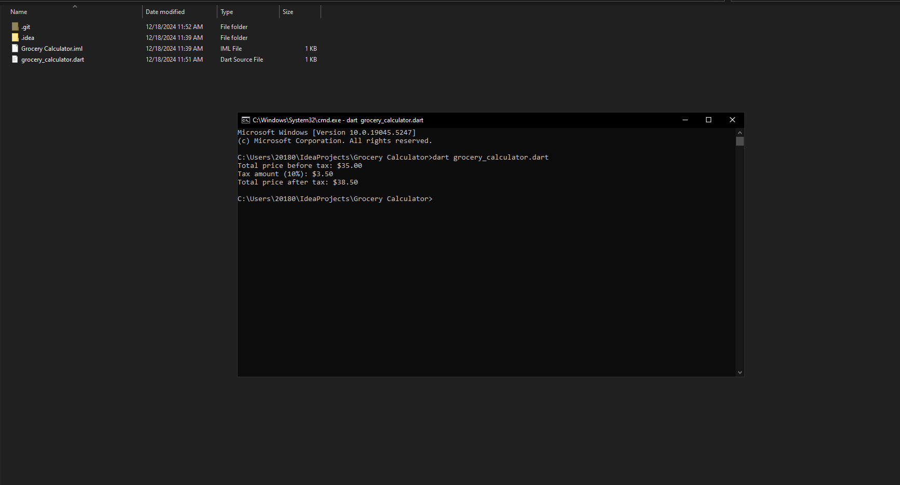

# Grocery Calculator

This Dart program calculates the total cost of grocery items, including a 10% tax. The program uses a list of maps to represent grocery items, with each map containing the item's name and price. The total cost is calculated using a loop, and the tax is added to the total.

## How to Run

1. Ensure you have Dart installed on your machine.
2. Clone this repository.
3. Run the program using the command: `dart grocery_calculator.dart`.

## Output

The program will print the total price before and after tax.

